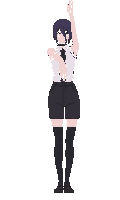

# 2026_2_Cringe_Driven_Development

Frontend-репозиторий проекта «Colab» команды «Cringe Driven Development»

<picture>
<source media="(max-width: 600px)" srcset=".github/assets/dance.gif 0.5x">
<source srcset=".github/assets/dance.gif 1.1x">

</picture>

### Ссылки

- [Доска задач](https://github.com/orgs/Cringe-Driven-Development-Team/projects/1)
- [Макеты в Figma](https://www.figma.com/design/iWGdAUKc8v8oaIGhM9X20T/Colab)
- [Репозиторий бэкенда](https://github.com/go-park-mail-ru/2026_2_Cringe_Driven_Development)
- [Организация команды](https://github.com/Cringe-Driven-Development-Team)

### Участники команды

1. [Ерофей Гаранин](https://github.com/ManInTheCoat)
2. [Истратов Денис](https://github.com/iRedTea)
3. [Шпакова Дарья](https://github.com/GrayMouse9)
4. [Кунев Валентин](https://github.com/MrDuckVC)

### Менторы

- [Михалёв Ярослав](https://github.com/YarikMix) — _Frontend_
- [Батовкин Александр](https://github.com/blackHATred) — _Backend_
- [Ченцова Дарья](https://t.me/dewon_d) — _UX_

## Как работать с задачами

Все задачи команды, фронтовые и бэковые, живут на одной
[доске](https://github.com/orgs/Cringe-Driven-Development-Team/projects/1)

> [!IMPORTANT]
> Задача заводится issue в той репе, где будет код: фронтовые — здесь, бэковые —
> в [репозитории бэкенда](https://github.com/go-park-mail-ru/2026_2_Cringe_Driven_Development).
> Issue, заведённая не в той репе, не свяжется с pull request

1. **Взять задачу.** На доске выбрать карточку из `Ready`, поставить себя
   в `Assignees`, перевести в `In progress`

2. **Создать ветку.** Открыть issue → в правой колонке кнопка
   **`Create a branch for this issue`**. GitHub предложит имя, собранное из заголовка
   задачи, — заменить его на `web-<номер issue>`, например `web-12`.
   Затем `Create branch` и локально:

   ```bash
   git fetch
   git switch web-12
   ```

3. **Закоммитить** по шаблону `<тип>: <описание>`, типы — в таблице ниже.
   Область в скобках после типа указывать необязательно:

   ```
   feat: добавить форму входа
   fix: не сбрасывать фокус при ошибке валидации
   refactor(editor): вынести подсветку синтаксиса в отдельный модуль
   ```

4. **Открыть pull request** в `main`, когда код готов к ревью.
   Заголовок — по шаблону `WEB-<номер issue>: <название issue>`, например
   `WEB-12: Форма входа`.
   Убедиться, что в правой колонке PR в блоке `Development` указана задача —
   если её там нет, связь потерялась

5. **Получить апрув** от [Ярослава](https://t.me/Yaroslav738)

6. **Влить в `main`** через `Merge pull request`.
   Issue закроется сама, карточка уедет в `Done`

> [!WARNING]
> Не создавать ветку через `git checkout -b` и не переименовывать уже созданную.
> В обоих случаях pull request не свяжется с задачей, она не закроется сама,
> и доска будет врать. Имя ветки задаётся один раз — в диалоге `Create a branch`

> [!TIP]
> Если ветка всё же создана локально, в описание pull request нужно добавить строку
> `Closes #<номер issue>`, иначе задача останется открытой

## Типы коммитов

> [!NOTE]
> Коммиты ветки попадают в `main` как есть, поэтому от их качества зависит
> читаемость истории проекта. Сверху добавляется merge-коммит с названием
> pull request


| Тип | Когда используется |
|---|---|
| `feat` | новая функциональность |
| `fix` | исправление бага |
| `refactor` | код переписан, поведение не изменилось |
| `style` | форматирование и отступы, логика не тронута |
| `test` | тесты |
| `docs` | документация |
| `chore` | конфиги, зависимости, сборка, CI |

## Статусы на доске

| Статус | Что означает |
|---|---|
| `Backlog` | задача заведена, но не запланирована в спринт |
| `Ready` | взята в спринт, можно брать в работу |
| `In progress` | в работе |
| `In review` | открыт pull request, ждёт ревью |
| `Done` | влито в `main` |

Статусы доска двигает сама по событиям в pull request. Руками нужно только взять задачу в работу — остальное происходит автоматически
