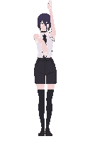

# 2026_2_Cringe_Driven_Development

Frontend-репозиторий проекта «Colab» команды «Cringe Driven Development»

<picture>
<source media="(max-width: 600px)" srcset=".github/assets/dance.gif 1.2x">
<source srcset=".github/assets/dance.gif 0.75x">

</picture>

### Ссылки

[](https://cellestial.ru)
[](https://github.com/orgs/Cringe-Driven-Development-Team/projects/1)
[](https://www.figma.com/design/7iaVDGiwzQk2vZIB5ogVlq/Colab)
[](https://cringe-driven-development-team.github.io/docs/)
[](https://github.com/go-park-mail-ru/2026_2_Cringe_Driven_Development)
[](https://github.com/Cringe-Driven-Development-Team)

### Участники команды

1. [Ерофей Гаранин](https://github.com/ManInTheCoat)
2. [Истратов Денис](https://github.com/iRedTea)
3. [Шпакова Дарья](https://github.com/GrayMouse9)
4. [Кунев Валентин](https://github.com/MrDuckVC)

### Менторы

- [Михалёв Ярослав](https://github.com/YarikMix) — _Frontend_
- [Батовкин Александр](https://github.com/blackHATred) — _Backend_
- [Ченцова Дарья](https://t.me/dewon_d) — _UX_

## Как работать с задачами

Код лежит здесь, а задачи — в
[Cringe-Driven-Development-Team/frontend](https://github.com/Cringe-Driven-Development-Team/frontend)
и на общей [доске](https://github.com/orgs/Cringe-Driven-Development-Team/projects/1) вместе с бэковыми

1. **Завести задачу** в репозитории `frontend`. Как завести и что писать в описании —
   в [гайдлайне организации](https://github.com/Cringe-Driven-Development-Team/.github/blob/main/CONTRIBUTING.md#как-завести)

2. **Взять задачу.** На доске выбрать карточку из `Ready`, поставить себя
   в `Assignees`, перевести в `In progress`

3. **Создать ветку.** Открыть задачу → в правой колонке `Development` →
   **`Create a branch`**. В `Repository destination` выбрать
   `frontend-park-mail-ru/2026_2_Cringe_Driven_Development` (в поиске — `2026_2`),
   имя ветки заменить на `web-<номер задачи>`, например `web-12`.
   Затем `Create branch` и локально:

   ```bash
   git fetch
   git switch web-12
   ```

4. **Закоммитить** по шаблону `<тип>: <описание>`, типы — в таблице ниже.
   Область в скобках после типа указывать необязательно:

   ```
   feat: добавить форму входа
   fix: не сбрасывать фокус при ошибке валидации
   refactor(editor): вынести подсветку синтаксиса в отдельный модуль
   ```

5. **Открыть pull request** в `main`, когда код готов к ревью.
   Заголовок — по шаблону `WEB-<номер задачи>: <название задачи>`, например
   `WEB-12: Форма входа`. В описании — **обязательно** строка

   ```
   Closes Cringe-Driven-Development-Team/frontend#12
   ```

   Почему ссылка полная и что писать, если задача затрагивает ещё один репозиторий, —
   в [гайдлайне](https://github.com/Cringe-Driven-Development-Team/.github/blob/main/CONTRIBUTING.md#как-закрыть).
   Убедиться, что в правой колонке PR в блоке `Development` указана задача

6. **Получить апрув** от [Ярослава](https://t.me/Yaroslav738)

7. **Влить в `main`** через `Merge pull request`.
   Задача закроется сама, карточка уедет в `Done`

> [!TIP]
> Ветку, созданную руками (`git switch -c web-12 origin/main`), с задачей свяжет
> та же строка `Closes …` — поэтому она обязательна всегда

## Выкатка

Клиент собирается в CI и заливается в S3 неизменяемыми релизами. Заливка автоматическая, выкатка
на cellestial.ru — по кнопке: человек выбирает, какой из залитых релизов и когда сделать текущим.
Откат — смена указателя. Шаги — команды скрипта `scripts/release/` (TypeScript под `bun`):
`bun run release <команда>`

| Workflow | Когда | Что делает |
|---|---|---|
| `CI` | pull request и push в `main` | `bun run check` и `bun run build`; на push в `main` — ещё сборка с `base` на CDN → `releases/{sha}/` → Release check → сообщение в Telegram «релиз залит» с кнопкой «Выкатить». Пользователи релиз не видят |
| `CD` | вручную из `main`, вход `sha` (пусто — голова `main`) | релиз есть в бакете → Release check → `index.html` и `current.json` → Health check → в S3 остаются 5 релизов → сообщение в Telegram |
| `Rollback` | вручную: `Actions` → `Rollback` → `Run workflow` из `main` | Release check релиза `previous` → возвращает его, `stable` и `previous` меняются местами → Health check → сообщение в Telegram |

Выкатить релиз: `Actions` → `CD` → `Run workflow` из `main`, в поле `sha` — полный sha коммита
(он есть в сообщении о заливке), либо `gh workflow run cd.yml -f sha=<sha>`

В бакете: `releases/{sha}/` — сборка, корневой `index.html` — копия `index.html` текущего релиза,
`current.json` — `{ "stable": "{sha}", "previous": "{sha}" }`

`CD` выкатывает только вперёд по истории `main`: текущий `stable` должен быть предком `sha`, иначе
`release promote` падает и ничего не меняет. Выкати `CD` релиз старше `stable` — в `previous`
оказался бы более новый релиз, и `Rollback` «откатил» бы вперёд. Повторная выкатка того же `sha`
проходит. Назад — только `Rollback`: он возвращает `previous`, на один шаг; повторный `Rollback`
возвращает откаченный релиз обратно

`CD` падает на шаге `Release exists`, если релиза `sha` в бакете нет: в S3 хранятся 5 последних
релизов (плюс `stable` и `previous`), а между выкатками их может залиться больше; не залит и
коммит, чей запуск `CI` вытеснили более новые push. Перезалить — открыть запуск `CI` этого
коммита в `main` и нажать `Re-run all jobs`

Релиз проверяется до переключения:

- **Release check** — `index.html` релиза и чанк из него отдаются с CDN, чанк — с заголовком CORS.
  Выполняется после заливки и ещё раз перед выкаткой. Не прошёл — указатель не меняется, на сайте
  прежний релиз
- **Health check** — после переключения `https://cellestial.ru/` отдаёт `<meta name="release">`
  нового релиза, ожидание до 3 минут. Не прошёл — job красный, отката нет: релиз уже проверен,
  сломана отдача через Caddy или кэш бакета, смотреть нужно их

### Очередь выкатки

Указатель релиза меняет кто-то один: `CD` и `Rollback` стоят в общей группе `concurrency`.
Очереди в группе нет — она держит один идущий запуск и один ожидающий, более новый ожидающий
вытесняет прежнего. Вытесненный запуск отмечен в `Actions` как `cancelled`, сообщения в Telegram
от него нет — job не стартовал. Релиз при этом остаётся в бакете: нужен — запустить `CD` с тем же
`sha` ещё раз

Выкатка и откат работают в environment `production` (`Settings` → `Environments`), доступном
только из `main`:

| Что | Имя | Откуда (`pulumi stack output` в `infra`) |
|---|---|---|
| секрет | `S3_ACCESS_KEY` | `s3AccessKey --show-secrets` |
| секрет | `S3_SECRET_KEY` | `s3SecretKey --show-secrets` |
| переменная | `S3_ENDPOINT` | `s3Endpoint` |
| переменная | `S3_BUCKET` | `s3Bucket` |
| переменная | `CDN_URL` | `cdnCustomDomain` |

> [!WARNING]
> Ключ S3 действует на весь проект Selectel, а не только на бакет релизов: ограничение
> environment веткой `main` снимать нельзя

## Типы коммитов

> [!NOTE]
> Коммиты ветки попадают в `main` как есть, поэтому от их качества зависит
> читаемость истории проекта. Сверху добавляется merge-коммит с названием
> pull request


| Тип | Когда используется |
|---|---|
| `feat` | новая функциональность |
| `fix` | исправление бага |
| `refactor` | код переписан, поведение не изменилось |
| `style` | форматирование и отступы, логика не тронута |
| `test` | тесты |
| `docs` | документация |
| `chore` | конфиги, зависимости, сборка, CI |

## Статусы на доске

| Статус | Что означает |
|---|---|
| `Backlog` | задача заведена, но не запланирована в спринт |
| `Ready` | взята в спринт, можно брать в работу |
| `In progress` | в работе |
| `In review` | открыт pull request, ждёт ревью |
| `Done` | влито в `main` |

Статусы доска двигает сама по событиям в pull request. Руками нужно только взять задачу в работу — остальное происходит автоматически
